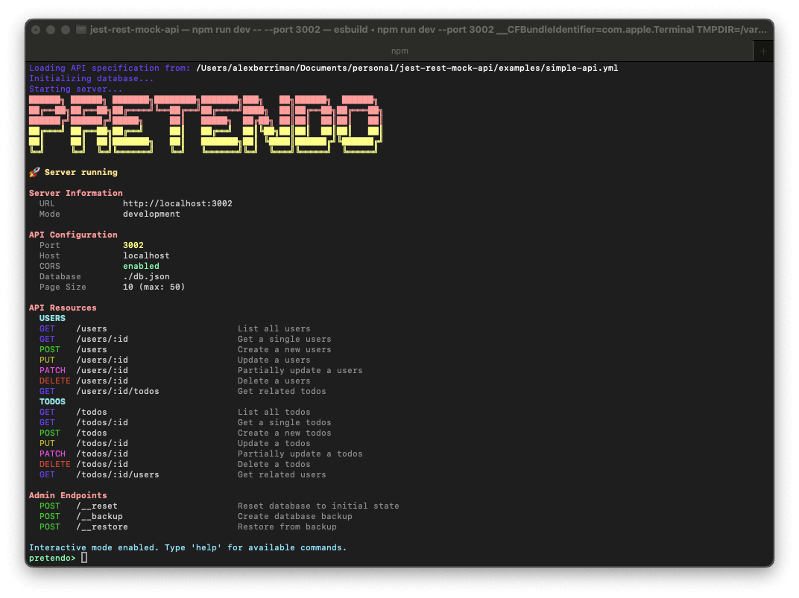

<div align="center">
  <h1>🚀 Pretendo</h1>
  <b>Create powerful, customizable mock REST APIs in seconds 🔥</b>
  
  
  
  <h4>🏀 Have a play:</h4>
  <code>npx pretendo start repo://simple-api.yml</code>
</div>

## 🌟 Introduction

**Pretendo** is a supercharged development tool for frontend developers who need a fully-featured REST API without the hassle of setting up a real backend.

**Why we built this:**

- **Speed up development** - Start building your frontend immediately without waiting for backend APIs
- **Work offline** - Develop without relying on external services
- **Test edge cases easily** - Simulate errors, latency, and various response scenarios
- **Show realistic prototypes** - Demo with real data flows and interactions
- **Control complexity** - Scale your mock API with your needs, from simple endpoints to complex relationships

With a simple YAML or JSON configuration, you get a complete RESTful service with CRUD operations, relationships, filtering, pagination, authentication, and more - all ready to use in seconds!

See our [Introduction](./docs/introduction.md) for a more detailed overview.

## 📚 Documentation

For comprehensive documentation, check out the [docs directory](./docs/README.md):

- [API Schema](./docs/schema.md) - How to define your API resources and fields
- [API Design](./docs/api-design.md) - REST principles and conventions used
- [Filtering](./docs/filtering.md) - Query and filter your data
- [Sorting](./docs/sorting.md) - Sort your collections
- [Pagination](./docs/pagination.md) - Paginate large datasets
- [Relationships](./docs/relationships.md) - Work with related resources
- [Special Fields](./docs/special-fields.md) - Dynamic computed field values
- [Configuration](./docs/configuration.md) - Configure your mock API
- [Authentication](./docs/authentication.md) - Secure your endpoints

## ✨ Features

- **🚀 Zero Setup Required** - Define your API with a straightforward YAML/JSON spec
- **📄 Remote Schemas** - Load schemas from local files or remote URLs (GitHub URLs supported!)
- **🔄 Full CRUD Operations** - Auto-generated RESTful endpoints for all resources ([CRUD docs](./docs/crud.md))
- **📝 Custom Routes** - Define custom JSON and JavaScript routes alongside resource endpoints ([Custom Routes docs](./docs/custom-routes.md))
- **🔒 Secure JavaScript Execution** - Optional pluggable hooks for secure, isolated JavaScript execution ([Custom Routes docs](./docs/custom-routes.md))
- **✨ Special Field Values** - Computed dynamic values like timestamps, UUIDs, auto-increment, and more ([Special Fields docs](./docs/special-fields.md))
- **🔗 Advanced Relationships** - Model one-to-many, many-to-many, and belongs-to relationships ([Relationships docs](./docs/relationships.md))
- **🔍 Rich Querying Capabilities**:
  - Filtering with operators (`gt`, `lt`, `contains`, `startsWith`, etc.) ([Filtering docs](./docs/filtering.md))
  - Sorting by multiple fields with direction control ([Sorting docs](./docs/sorting.md))
  - Pagination with RFC-compliant Link headers ([Pagination docs](./docs/pagination.md))
  - Field selection for partial responses ([Field Selection docs](./docs/field-selection.md))
  - Relationship expansion with nested data ([Relationship Expansion docs](./docs/relationship-expansion.md))
  - UUID support for primary keys ([UUID Support docs](./docs/uuid-example.md))
- **🔒 Authentication & Authorization** - Built-in JWT auth with configurable users and roles, plus robust RBAC ([Authentication docs](./docs/authentication.md))
- **🌐 Network Simulation** - Configurable latency and error rates for realistic testing ([Network Simulation docs](./docs/network-simulation.md))
- **💾 Data Persistence** - State saved to file for continued development ([Persistence docs](./docs/persistence.md))
- **⚡ Performance** - Optimized for speed, even with large datasets
- **🧪 Test-Friendly** - Perfect for unit, integration and e2e testing
- **🔧 Highly Extensible** - Use as CLI or programmatically in your code

## 🚀 Quick Start

### Installation

```bash
# No installation needed! Run directly with npx:
npx pretendo start repo://blog-api.yml

# Global installation for CLI use
npm install -g pretendo

# Local project installation
npm install --save-dev pretendo
```

See the [Installation Guide](./docs/installation.md) for more options.

### CLI Usage

Create a `api.yml` file:

```yaml
resources:
  - name: users
    fields:
      - name: id
        type: number
      - name: name
        type: string
      - name: email
        type: string
    relationships:
      - type: hasMany
        resource: posts
        foreignKey: userId

  - name: posts
    fields:
      - name: id
        type: number
      - name: title
        type: string
      - name: content
        type: string
      - name: userId
        type: number
    relationships:
      - type: belongsTo
        resource: users
        foreignKey: userId

options:
  port: 3000
  latency:
    enabled: true
    min: 50
    max: 200
```

Start the server:

```bash
# Using npx (no installation required)
npx pretendo start api.yml

# Using installed CLI
pretendo start api.yml

# Start with remote URL (GitHub URLs auto-download)
npx pretendo start https://raw.githubusercontent.com/alexberriman/pretendo/main/examples/blog-api.yml

# Using repository shorthand
npx pretendo start repo://blog-api.yml

# Skip confirmation for non-GitHub URLs
npx pretendo start https://example.com/api.yml --no-prompt
```

For a step-by-step tutorial, see our [Quick Start Guide](./docs/quick-start.md).

### Programmatic Usage

Pretendo can be used programmatically in your Node.js applications:

```typescript
import { createMockApi } from "pretendo";

const spec = {
  resources: [
    {
      name: "users",
      fields: [
        { name: "id", type: "number" },
        { name: "name", type: "string" },
        { name: "email", type: "string" },
      ],
    },
  ],
  options: { port: 3000 },
};

async function startServer() {
  const result = await createMockApi({ spec });

  if (result.ok) {
    console.log(`🚀 Server running at: ${result.value.getUrl()}`);

    // Shutdown when needed
    // await result.value.stop();
  }
}

startServer();
```

#### Extended Programmatic Features

Pretendo offers powerful programmatic features for advanced use cases:

```typescript
import { createMockApi } from "pretendo";

const api = await createMockApi({
  // API specification
  spec: {
    resources: [/* resources */],
    options: {/* options */}
  },
  
  // Add custom routes
  routes: (router) => {
    router.get('/health', (req, res) => {
      res.json({ status: 'ok' });
    });
    
    router.post('/webhook', (req, res) => {
      // Process webhook
      res.status(202).json({ received: true });
    });
  },
  
  // Add lifecycle hooks
  hooks: {
    onRequest: (req, res, next) => {
      // Log all requests
      console.log(`${req.method} ${req.path}`);
      next();
    },
    beforeRoute: (req, res, next) => {
      // Add custom header
      res.setHeader('X-Custom-Header', 'Value');
      next();
    }
  },
  
  // Custom JS execution (for secure isolation)
  executeJs: async (context) => {
    // Custom JavaScript execution
    // This can be used to run code in a secure environment
    return {
      status: 200,
      headers: {},
      body: { result: 'secure execution' }
    };
  }
});

await api.listen();
```

See the [Custom Routes documentation](./docs/custom-routes.md) for more details on programmatic usage.

## 🔄 REST API Features

The API design is based on RESTful principles from [GitHub: alexberriman/rest-api-design](https://github.com/alexberriman/rest-api-design). See the [API Design Principles](./docs/api-design.md) documentation for detailed conventions.

### Data Validation

Pretendo provides comprehensive field validation to ensure data integrity:

```yaml
fields:
  - name: username
    type: string
    required: true
    minLength: 3
    maxLength: 50
    pattern: "^[a-zA-Z0-9_]+$"
    unique: true
  
  - name: age
    type: number
    min: 18
    max: 120
  
  - name: role
    type: string
    enum: ["admin", "user", "editor"]
```

See [Resource Validation](./docs/resources.md#field-validation-rules) for complete documentation.

### CRUD Operations

```
GET    /users                                    # List all users (paginated)
GET    /users/123                                # Get user with numeric ID
GET    /users/550e8400-e29b-41d4-a716-446655440000  # Get user with UUID
POST   /users                                    # Create a new user
PUT    /users/123                                # Replace user
PATCH  /users/123                                # Update user
DELETE /users/123                                # Delete user
```

See [CRUD Operations](./docs/crud.md) for complete details.

### Filtering

```
# Simple equality
GET /users?role=admin

# Advanced operators
GET /users?age_gt=21
GET /users?name_like=john
GET /posts?title_startsWith=Hello
GET /products?price_gte=10&price_lte=100
GET /users?tags_in=developer,designer
```

See [Filtering Documentation](./docs/filtering.md) for more details.

### Sorting

```
# Ascending sort (default)
GET /users?sort=name

# Descending sort
GET /users?sort=-createdAt

# Multiple sort fields
GET /users?sort=role,-name
```

See [Sorting Documentation](./docs/sorting.md) for more details.

### Pagination

```
GET /users?page=2&limit=10
```

Response includes pagination metadata and RFC 5988 Link headers:

```json
{
  "data": [...],
  "meta": {
    "pagination": {
      "currentPage": 2,
      "limit": 10,
      "totalPages": 5,
      "totalItems": 48,
      "links": {
        "first": "http://localhost:3000/users?page=1&limit=10",
        "prev": "http://localhost:3000/users?page=1&limit=10",
        "next": "http://localhost:3000/users?page=3&limit=10",
        "last": "http://localhost:3000/users?page=5&limit=10"
      }
    }
  }
}
```

See [Pagination Documentation](./docs/pagination.md) for more options.

### Field Selection

```
GET /users?fields=id,name,email
```

See [Field Selection Documentation](./docs/field-selection.md) for advanced usage.

### Relationship Expansion

```
# Single relationship
GET /posts?expand=author

# Multiple relationships
GET /posts?expand=author,comments

# Nested relationships
GET /posts?expand=author.profile,comments.user
```

See [Relationship Expansion Documentation](./docs/relationship-expansion.md) for more details.

## 🔧 Configuration Options

```yaml
# Global options
options:
  # Server options
  port: 3000
  host: localhost
  corsEnabled: true

  # Authentication
  auth:
    enabled: true
    jwt:
      secret: "your-secret-key"
      expiresIn: "1h"
    users:
      - username: admin
        password: password
        role: admin

  # Network simulation
  latency:
    enabled: true
    min: 50
    max: 200

  # Database options
  dataFile: ./db.json
  defaultPageSize: 10
  maxPageSize: 100

# Custom routes at the API level
routes:
  - path: "/status"
    method: "get"
    type: "json"
    response:
      status: "operational"
      version: "1.0.0"
      environment: "production"
  
  - path: "/users/:id/profile"
    method: "get"
    type: "json"
    response:
      user:
        id: "{id}"
        profile:
          bio: "Profile for user {id}"
          avatar: "https://example.com/avatars/{id}.jpg"
  
  - path: "/files/{*filePath}"
    method: "get"
    type: "javascript"
    code: "// Will serve files from paths in the future"
```

See [Configuration Documentation](./docs/configuration.md) for all available options.

## 🔒 Authentication & Authorization

Pretendo provides a comprehensive authentication and authorization system:

1. **Authentication**: JWT-based authentication for user identity
2. **Role-Based Access Control (RBAC)**: Control access based on user roles
3. **Ownership-Based Permissions**: Allow users to manage their own resources

When authentication is enabled:

1. Login to get a token:

```bash
curl -X POST http://localhost:3000/auth/login \
  -H "Content-Type: application/json" \
  -d '{"username": "admin", "password": "password"}'
```

Response:

```json
{
  "token": "eyJhbGciOiJIUzI1...",
  "user": {
    "username": "admin",
    "role": "admin",
    "id": 1
  },
  "expiresAt": 1609459200000
}
```

2. Use token for protected endpoints:

```bash
curl http://localhost:3000/users \
  -H "Authorization: Bearer eyJhbGciOiJIUzI1..."
```

### Role-Based Access Control

Configure different access levels for each resource:

```yaml
resources:
  - name: posts
    ownedBy: authorId
    access:
      list: ["*"]                # Any authenticated user can list
      get: ["*"]                 # Any authenticated user can view
      create: ["editor", "admin"] # Only editors and admins can create
      update: ["admin", "owner"] # Admin or the author can update
      delete: ["admin", "owner"] # Admin or the author can delete
```

See [Authentication Documentation](./docs/authentication.md) and [RBAC Documentation](./docs/role-based-access-control.md) for more details.

## 🧑‍💻 CLI Reference

```
pretendo start <file|url> [options]

Options:
  -p, --port <number>    Port to run the server on
  -h, --host <string>    Host to bind to
  --no-cors              Disable CORS support
  -d, --db <path>        Path to database file
  --delay <ms>           Add fixed delay to all responses
  --error-rate <rate>    Add random errors (0-1 probability)
  --reset                Reset database before starting
  --no-interactive       Disable interactive CLI mode
  --no-prompt            Skip download confirmation for URLs
```

### Interactive CLI Mode

When running in interactive mode, Pretendo provides a powerful command-line interface:

```
Available commands:
  help                    Show this help message
  routes                  List all API routes
  request <method> <url>  Make a request to the API
  config                  Show current configuration
  examples                List available example specifications
  logs [options]          View server request logs
  stats                   Show server statistics
  clear                   Clear the console
  exit                    Exit the application
```

#### Special URL Schemes

You can use the `repo://` URL scheme to quickly load example configurations:

```bash
# Load an example from the Pretendo repository (no installation needed)
npx pretendo start repo://simple-api.yml

# List all available examples
npx pretendo examples

# This automatically expands to:
# https://raw.githubusercontent.com/alexberriman/pretendo/refs/heads/main/examples/simple-api.yml
```

See [CLI Reference](./docs/cli-reference.md) for complete documentation.

## 📚 Examples

Check the `examples` directory for complete API specifications or run them directly:

```bash
# List all available examples
npx pretendo examples

# Run the simple API example
npx pretendo start repo://simple-api.yml

# Run the blog API example
npx pretendo start repo://blog-api.yml

# Run the e-commerce API example
npx pretendo start repo://e-commerce-api.yml

# Run the UUID API example
npx pretendo start repo://uuid-api.yml
```

Example specifications:

- [Simple API](./examples/simple-api.yml)
- [Blog API](./examples/blog-api.yml)
- [E-commerce API](./examples/e-commerce-api.yml)
- [UUID API](./examples/uuid-api.yml)

## 🧪 Testing

The mock API is perfect for integration and E2E testing:

```javascript
// Example with testing framework
describe("User API", () => {
  let server;

  beforeAll(async () => {
    const spec = {
      /* Your test API spec */
    };
    const result = await createMockApi({ spec });
    server = result.value;
  });

  afterAll(async () => {
    await server.stop();
  });

  test("should create a new user", async () => {
    const response = await fetch(`${server.getUrl()}/users`, {
      method: "POST",
      headers: { "Content-Type": "application/json" },
      body: JSON.stringify({ name: "Test User", email: "test@example.com" }),
    });

    expect(response.status).toBe(201);
    const data = await response.json();
    expect(data.name).toBe("Test User");
  });
});
```

## 📜 License

MIT

## 🤝 Contributing

Contributions are welcome! Feel free to open issues or submit pull requests.

1. Fork the repository
2. Create your feature branch: `git checkout -b feature/amazing-feature`
3. Commit your changes: `git commit -m 'Add some amazing feature'`
4. Push to the branch: `git push origin feature/amazing-feature`
5. Open a Pull Request

## 🌟 Show Your Support

Give a ⭐️ if this project helped you!
